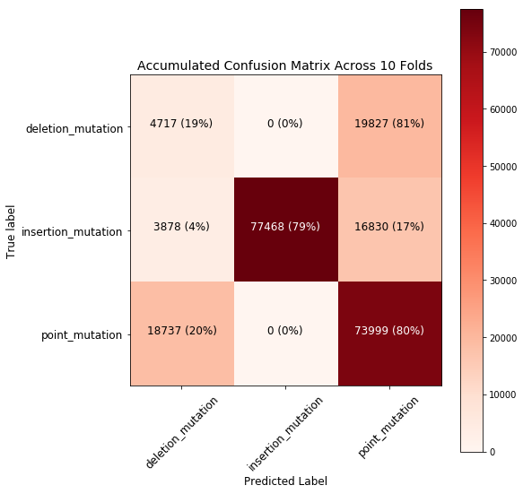

### Bioinformatics and Beyond Final Project
#### By Noah Segal-Gould
#### Explanation:
* In a homework assignment, we implemented a method for detecting the *type* of mutation which occurred between an original sequence and a sequence which underwent a single insertion, deletion, or point mutation.
* In this project, I approach this ***detection*** as a matter of text classification.
    * I implement a technique for acquiring all distinct insertion, deletion, and point mutations of a nucleotide sequence. It's really costly, so I limit the nucleotide sequences to be of maximum length **6**.
    * Then I use those strings as training data for a probabilistic Naive Bayes classifier. It's ***naive*** because it treats all features as *conditionally independent*, even when they obviously should be *dependent* **especially** when we're comparing sequences.
    * Finally, I use k-folds cross-validation to test the performance of this technique.


```python
import re
import json
import random
import itertools

import matplotlib.pyplot as plt
import numpy as np

from pprint import pprint
from itertools import product
from sklearn.pipeline import Pipeline
from sklearn.naive_bayes import MultinomialNB
from sklearn.feature_extraction.text import CountVectorizer
from sklearn.metrics import confusion_matrix
from sklearn.model_selection import KFold
from random import choice, shuffle, randint
%matplotlib inline
```


```python
class MutationsClassifier:
    def __init__(self, initial_sequence_length=3):        
        self.default_nucleotides = "ATCG"
        
        self.initial_sequence_length = initial_sequence_length
        
        self.data = self.generate_training_data()
        self.pipeline = Pipeline([
            ("vectorizer", CountVectorizer(stop_words=None, lowercase=False)),
            ("classifier", MultinomialNB())
        ])
        
    def generate_all_sequences_with_length(self, initial_sequence_length=3):
        return ["".join(n) for n in product(self.default_nucleotides, repeat=initial_sequence_length)]
                
    def all_point_mutations(self, sequence):
        point_mutations = []
        for mutation_index in range(len(sequence)):
            mutation_index_nucleotide = sequence[mutation_index]

            mutation_beginning = sequence[:mutation_index]
            mutation_end = sequence[mutation_index + 1:]
            
            for nucleotide in self.default_nucleotides.replace(mutation_index_nucleotide, ""):
                complete_point_mutation = mutation_beginning + nucleotide + mutation_end
                if sequence != complete_point_mutation:
                    point_mutations.append(complete_point_mutation)

        return list(set(point_mutations))

    def all_insertion_mutations(self, sequence):
        insertion_mutations = []
        for mutation_index in range(len(sequence)):
            insertion_beginning = sequence[:mutation_index]
            insertion_end = sequence[mutation_index:]
            for nucleotide in self.default_nucleotides:
                complete_insertion_mutation = insertion_beginning + nucleotide + insertion_end
                if complete_insertion_mutation != sequence:
                    insertion_mutations.append(complete_insertion_mutation)
            
        return list(set(insertion_mutations))

    def all_deletion_mutations(self, sequence):
        deletion_mutations = []
        for mutation_index in range(len(sequence)):
            complete_deletion_mutation = sequence[:mutation_index] + sequence[mutation_index + 1:]
            if complete_deletion_mutation != sequence:
                deletion_mutations.append(complete_deletion_mutation)
        return list(set(deletion_mutations))

    def generate_training_data(self):
        mutations = []
        for i in range(self.initial_sequence_length, (self.initial_sequence_length * 2) + 1):
            for sequence in self.generate_all_sequences_with_length(i):
                for point_mutation in self.all_point_mutations(sequence):
                    mutations.append((sequence + " " + point_mutation, "point_mutation"))
                for insertion_mutation in self.all_insertion_mutations(sequence):
                    mutations.append((sequence + " " + insertion_mutation, "insertion_mutation"))
                for deletion_mutation in self.all_deletion_mutations(sequence):
                    mutations.append((sequence + " " + deletion_mutation, "deletion_mutation"))
        shuffle(mutations)
        return mutations

    def classify(self, sequences):
        self.pipeline.fit([group[0] for group in self.data], 
                          [group[1] for group in self.data])
        return dict(zip(sequences, self.pipeline.predict(sequences).tolist()))
    
    def cross_validation(self, num_folds=10):
        text_training_data = np.array([row[0] for row in self.data])
        class_training_data = np.array([row[1] for row in self.data])
        kf = KFold(n_splits=num_folds, shuffle=True)

        cnf_matrix_test = np.zeros((3, 3), dtype=int)
        for i, (train_index, test_index) in enumerate(kf.split(text_training_data)):
            
            text_train, text_test = text_training_data[train_index], text_training_data[test_index]
            class_train, class_test = class_training_data[train_index], class_training_data[test_index]

            self.pipeline.fit(text_train, class_train)

            predictions_test = self.pipeline.predict(text_test)

            cnf_matrix_test += confusion_matrix(class_test, predictions_test)
            
            print("Fold #{} Complete.".format(i + 1))
            
        def plot_confusion_matrix(cm, title="Confusion Matrix", cmap=plt.cm.Reds):
            classes = self.pipeline.classes_
            cm_normalized = cm.astype("float") / cm.sum(axis=1)[:, np.newaxis]

            plt.imshow(cm, interpolation="nearest", cmap=cmap)
            plt.colorbar()

            plt.title(title, size=14)

            tick_marks = np.arange(len(classes))
            plt.xticks(tick_marks, classes, rotation=45, fontsize=12)
            plt.yticks(tick_marks, classes, fontsize=12)

            thresh = cm.max() / 2.
            for i, j in itertools.product(range(cm.shape[0]), range(cm.shape[1])):
                plt.text(j, i, "{} ({:.0%})".format(cm[i, j], cm_normalized[i, j]),
                        horizontalalignment="center", size=12,
                        color="white" if cm[i, j] > thresh else "black")

            plt.tight_layout()

            plt.ylabel("True label", fontsize=12)
            plt.xlabel("Predicted Label", fontsize=12)
        
        np.set_printoptions(precision=2)

        plt.figure(figsize=(8, 8))
        plot_confusion_matrix(cnf_matrix_test, title="Accumulated Confusion Matrix Across 10 Folds")
        plt.show()
        
        class_training_data = class_training_data.tolist()
        print("Total sequences in each class:")
        print("point_mutation: {}".format(class_training_data.count("point_mutation")))
        print("insertion_mutation: {}".format(class_training_data.count("insertion_mutation")))
        print("deletion_mutation: {}".format(class_training_data.count("deletion_mutation")))
```


```python
%%time
mutations_classifier_test_1 = MutationsClassifier()
```

    CPU times: user 446 ms, sys: 16.5 ms, total: 462 ms
    Wall time: 463 ms


```python
tests = ["GGGA TGGA",         # Should be a point mutation
         "GGAT TGAT",         # Should be a point mutation
         "CATTAC CATCAC",     # Should be a point mutation
         "GGA GG",            # Should be a deletion mutation
         "CGAT CGA",          # Should be a deletion mutation
         "CGATAG CGTAG",      # Should be a deletion mutation
         "CGTCAA CGTCAAA",    # Should be an insertion mutation
         "GAT GGAT",          # Should be an insertion mutation
         "CCCC CCTCC"]        # Should be an insertion mutation
```


```python
%%time
results_dictionary = mutations_classifier_test_1.classify(tests)
pprint(results_dictionary)
```

    {'CATTAC CATCAC': 'point_mutation',
     'CCCC CCTCC': 'deletion_mutation',
     'CGAT CGA': 'deletion_mutation',
     'CGATAG CGTAG': 'point_mutation',
     'CGTCAA CGTCAAA': 'insertion_mutation',
     'GAT GGAT': 'deletion_mutation',
     'GGA GG': 'deletion_mutation',
     'GGAT TGAT': 'deletion_mutation',
     'GGGA TGGA': 'deletion_mutation'}
    CPU times: user 1.58 s, sys: 76.7 ms, total: 1.65 s
    Wall time: 1.67 s


```python
print(mutations_classifier_test_1.all_point_mutations("CGATAG"))
```

    ['TGATAG', 'CGGTAG', 'CGAAAG', 'CGATTG', 'AGATAG', 'CGACAG', 'CTATAG', 'CGATCG', 'CGATAA', 'CGTTAG', 'CCATAG', 'CGATGG', 'CAATAG', 'GGATAG', 'CGATAC', 'CGAGAG', 'CGCTAG', 'CGATAT']


```python
print(mutations_classifier_test_1.all_insertion_mutations("CGATAG"))
```

    ['CCGATAG', 'CAGATAG', 'GCGATAG', 'CGAATAG', 'CGTATAG', 'CGACTAG', 'CGATAAG', 'CGATACG', 'CGATCAG', 'ACGATAG', 'CGATTAG', 'CGATAGG', 'CGCATAG', 'CGGATAG', 'CTGATAG', 'CGAGTAG', 'TCGATAG', 'CGATGAG', 'CGATATG']


```python
print(mutations_classifier_test_1.all_deletion_mutations("CGATAG"))
```

    ['GATAG', 'CATAG', 'CGATG', 'CGTAG', 'CGAAG', 'CGATA']


```python
%%time
mutations_classifier_test_2 = MutationsClassifier()
```

    CPU times: user 514 ms, sys: 32 ms, total: 546 ms
    Wall time: 556 ms


```python
%%time
mutations_classifier_test_2.cross_validation()
```

    Fold #1 Complete.
    Fold #2 Complete.
    Fold #3 Complete.
    Fold #4 Complete.
    Fold #5 Complete.
    Fold #6 Complete.
    Fold #7 Complete.
    Fold #8 Complete.
    Fold #9 Complete.
    Fold #10 Complete.





    Total sequences in each class:
    point_mutation: 92736
    insertion_mutation: 98176
    deletion_mutation: 24544
    CPU times: user 15.5 s, sys: 631 ms, total: 16.1 s
    Wall time: 16.4 s

